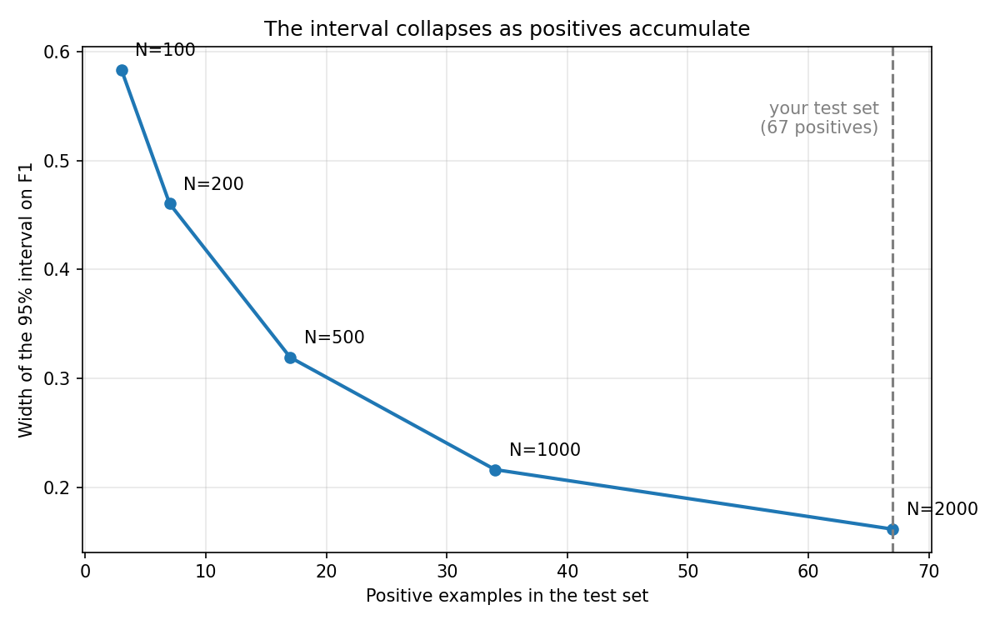

# Demo 2: Watch the Interval Collapse

Module 01, Section 5. Eight minutes, live, CPU only. Pure numpy, sklearn,
and matplotlib. No network, no model call, no Docker services. The sweep
cell is the only slow moment: about 14 seconds, and the rows print one at a
time as they finish, so the pause narrates itself.

## What this demo proves

1. The F1 of 0.4670 the room has quoted all morning carries a 95 percent
   interval of [0.3871, 0.5487]. The first decimal is solid; the rest were
   a costume.
2. A 200 review evaluation slice with 6 positives has an interval of
   [0.0952, 0.6000]: it cannot distinguish a good model from a bad one.
3. Interval width is governed by the positive count, not the row count, and
   it collapses predictably as positives accumulate: 3, 7, 17, 34, 67
   positives give widths 0.583, 0.460, 0.319, 0.216, 0.162.
4. The rule this buys: no model comparison without intervals.

## Files

| File | Purpose |
|---|---|
| `Demo02_Watch_the_Interval_Collapse_SOLUTION.ipynb` | Your copy, fully executed. Doubles as the fallback. Two instructor appendix cells: the paired comparison that makes the next slide's hypothetical real, and the Formative Check 3 ammunition. |
| `Demo02_Watch_the_Interval_Collapse_STUDENT.ipynb` | Follow along copy. Four YOUR TURN stubs; plumbing pre written. |
| `interval_collapse.png` | Pre rendered closing plot. This is the deck's named fallback for this demo. |
| `cordwell_test_set.csv` | Identical file to Demo 1 (same md5). One dataset, all day. |
| `make_dataset.py` | Regenerates the CSV bit for bit. |

## Pre-flight checklist (5 minutes, before class)

- [ ] Same directory: both notebooks, the CSV, and `interval_collapse.png`.
- [ ] Fresh kernel, Run All on your SOLUTION copy: `12 of 12 checks
      passing`. Full run is about 40 seconds including both appendix cells.
- [ ] Untouched STUDENT copy, Run All: no red cells, `1 of 12 checks
      passing`.
- [ ] Demo 1 already ran today, so the room knows this dataset and the
      0.4670. If Demo 1 was skipped, spend 30 extra seconds in Beat 0
      establishing the number.
- [ ] Know your own answer to "guess the width" before you ask the room.

## Room setup

Students open the STUDENT notebook and Run All. Four stubs this time, and
ST-1 is the centerpiece: they write the actual resampling loop. Tell them
the two `np.asarray` lines and the function shell are pre written on
purpose, and the checks cell is theirs to rerun freely.

## Beat by beat

Total 8 minutes. The sweep's 14 seconds of compute happen inside Beat 4 and
are talked over, not waited on.

### Beat 0: Frame it (30 seconds, talk only)

> "All morning we have said 0.4670. Four decimal places. That number came
> from sixty seven positive examples. The slide asked: collect a different
> sixty seven from the same population and how far does the number move?
> You each made a guess. Let us buy the answer with thirteen lines of
> numpy."

### Beat 1: The thirteen line bootstrap (2 min)

Walk the pre written shell first: the two coercion lines (pandas indexes by
label, numpy by position; without these the function crashes on the output
of the split from this morning's slide), the seeded generator, the empty
list. Then type ST-1, narrating each line:

```python
idx = rng.integers(0, n, n)      # resample WITH replacement
if y_true[idx].sum() == 0:       # skip degenerate resamples
    continue
vals.append(metric(y_true[idx], y_pred[idx], zero_division=0))
```

Talk track:

> "One resample is a fake alternate test set: two thousand rows drawn from
> our own two thousand, with replacement, so some reviews show up twice and
> some sit out. That is the whole trick. We cannot afford to re collect the
> test set, so we simulate re collecting it from the data we have. Score
> each fake test set, repeat two thousand times, and the middle 95 percent
> of those scores is the confidence interval. No calculus, no lookup
> tables, no new dependency, and it works for any metric you can pass as a
> function."

The guard line: with replacement, an unlucky resample can contain zero
positives, and F1 does not exist there. Skip it. Foreshadow: at the small
end of the sweep this stops being rare.

### Beat 2: The interval on the number we trusted (1.5 min)

Collect two or three width guesses out loud. Then type ST-2:

```python
ci_full = bootstrap_ci(y_test, y_pred, f1_score)
width_full = ci_full[1] - ci_full[0]
```

Expected output (about 4 seconds of compute):

```
F1 point estimate: 0.4670
95% interval:      [0.3871, 0.5487]
Width:             0.1616
```

Talk track:

> "Zero point three nine to zero point five five. The first decimal is
> solid. The second is in doubt. The third and fourth were a costume. And
> nothing was wrong with our evaluation: right metric, honest test set,
> clean split. Sixty seven positives is simply how much certainty two
> thousand rows buys at a three percent base rate."

### Beat 3: The 200 row slice (1.5 min)

Frame it as the proposal someone will actually make: evaluate on a quick
200 review sample to save labeling budget. Type ST-3 (the sample line with
its pinned seed is pre written):

```python
y_slice = slice_df["y_true"].to_numpy()
p_slice = (slice_df["y_score"].to_numpy() >= 0.50).astype(int)
ci_slice = bootstrap_ci(y_slice, p_slice, f1_score)
```

Expected output:

```
Rows: 200   Positives: 6
F1 point estimate: 0.3636
95% interval:      [0.0952, 0.6000]
Width:             0.5048
```

Talk track:

> "Six positives. The interval runs from zero point one to zero point six.
> That spans essentially the entire useful range for this task, which means
> this evaluation can tell you that you have a model rather than a coin,
> and nothing else. And notice what governed it: not the two hundred rows.
> The six positives. With rare positives your effective test set size is
> the positive count. Two thousand rows sounded like plenty this morning.
> It bought us sixty seven."

These slice numbers match the slide table exactly.

### Beat 4: The collapse (2 min, the memorable moment)

Point at the pre written `subset` helper: stratified sampling, the same
`stratify` discipline from the morning's split slide, so the base rate
survives at every size. Then type the ST-4 loop body:

```python
sub = subset(df, N)
yt = sub["y_true"].to_numpy()
yp = (sub["y_score"].to_numpy() >= 0.50).astype(int)
lo, hi = bootstrap_ci(yt, yp, f1_score)
sweep_rows.append({"N": N, "positives": int(yt.sum()),
                   "f1": f1_score(yt, yp), "lo": lo, "hi": hi,
                   "width": hi - lo})
```

Run it and talk over the 14 seconds as rows land:

```
    N  pos     F1      lo      hi   width
  100    3  0.462   0.167   0.750   0.583
  200    7  0.345   0.095   0.556   0.460
  500   17  0.459   0.281   0.600   0.319
 1000   34  0.462   0.348   0.564   0.216
 2000   67  0.467   0.387   0.549   0.162
```

While it computes:

> "Watch the width column. Also watch the F1 column wobble: 0.46, 0.35,
> 0.46. Those are all the same model on the same distribution. That wobble
> IS the noise the interval is measuring."

Then run the pre written plot cell. The dashed line at 67 positives is the
moment the deck names: point at it.

> "That dashed line is you. Your test set, the one we have used all day,
> sits right there: 67 positives, width 0.16. Good enough to gate a
> release. Nowhere near a fourth decimal place. And look at the shape of
> the curve: it is flattening. Width shrinks roughly with the square root
> of the positive count, so the next big improvement costs a multiple of
> every label you have collected so far. This curve is your labeling
> budget conversation, in one picture."

### Wrap (30 seconds)

> "The rule this buys is on the next slide, and it is the rule for the rest
> of the week: no model comparison without intervals. Two F1 numbers two
> points apart, each with an interval sixteen points wide, is not a
> ranking. It is noise wearing one."

Have everyone rerun the checks cell: at or near `12 of 12`.

## Fallback path

The deck's named fallback is the pre rendered plot: `interval_collapse.png`
ships in this folder and is embedded below. If a kernel dies mid demo, open
the executed SOLUTION notebook and walk the same beats off the captured
outputs; every expected output block above except the flagged transcription
guard is verbatim from it.



## What breaks, and the recovery

| Symptom | Cause | Recovery |
|---|---|---|
| ST-1 produces a different interval than the projector | `np.random.randint` or an unseeded generator instead of `rng.integers` on the seeded generator | The checks pin the exact values; the fix is using the pre written `rng`. Determinism via seeded generators is itself a lesson from Week 1, say so. |
| `KeyError` or wrong rows inside the loop | Student deleted the `np.asarray` lines and passed a pandas Series | This is the exact failure the slide's comment warns about. Show it, restore the two lines, move on. It is the best 20 second detour available. |
| Sweep cell feels hung | It is the 14 seconds of compute | Rows print as they land. If a student sees nothing for 30 plus seconds, their ST-1 loop is appending nothing; rerun checks. |
| Plot cell shows nothing | `sweep_rows` empty because ST-4 stub not filled | The plot cell is guarded on purpose; fill ST-4. |

## Timing summary

| Beat | Minutes |
|---|---|
| 0 Frame | 0.5 |
| 1 The bootstrap | 2.0 |
| 2 Full set interval | 1.5 |
| 3 The 200 row slice | 1.5 |
| 4 The collapse and plot | 2.0 |
| Wrap | 0.5 |

## Verification ledger

Execution confirmed, this environment (Python 3.12.3, numpy 2.4.4,
pandas 3.0.2, scikit-learn 1.8.0, matplotlib 3.10.8):

- All expected output blocks are verbatim from the executed solution
  notebook.
- Slice numbers match the deck exactly: 6 positives, F1 0.364, interval
  [0.095, 0.600], width 0.505.
- Full set interval on the shipped dataset is [0.3871, 0.5487], width
  0.1616. The deck prints [0.383, 0.543], width 0.160. See the README
  errata note: the deck values sit inside the seed to seed Monte Carlo
  range of the same measurement and should be updated to the executed
  values on the next slide pass.
- Sweep positive counts 3, 7, 17, 34, 67 with strictly decreasing widths
  0.583, 0.460, 0.319, 0.216, 0.162; sweep wall clock measured 13 to 14
  seconds, consistent with the deck's "roughly 15 seconds" claim.
- Formative Check 3 support: a 40 positive subset of this file yields
  width 0.214, inside the answer slide's claimed 0.15 to 0.25 band.
- Appendix paired comparison: A 0.4670 vs B 0.4898, paired difference
  interval [-0.0196, 0.0591], width 0.0787 vs 0.1616 individual. This
  instantiates the comparison slide's hypothetical (0.467 vs 0.489) with
  executed numbers.
- Solution notebook 12 of 12 checks; student cold run zero errors at 1 of
  12; completability confirmed at 12 of 12 by automated stub fill.

Estimates pending instructor dry run: per beat wall clock timings.
